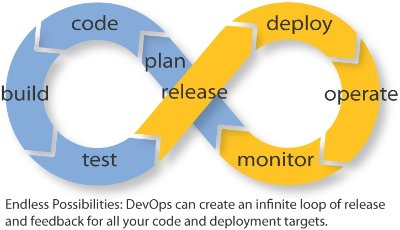
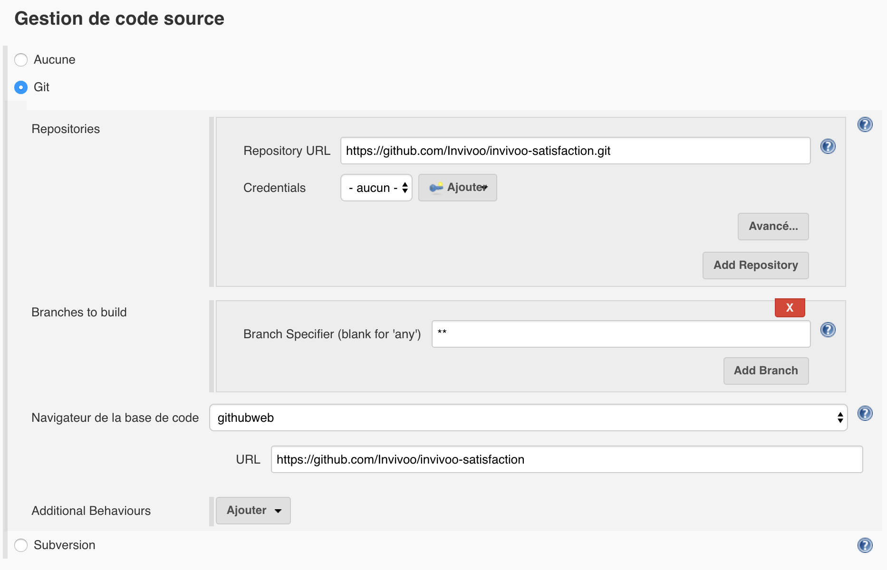
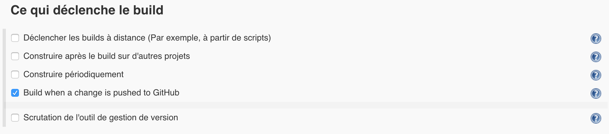
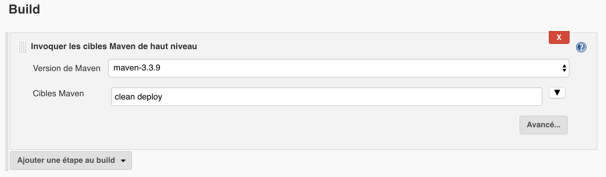

= Continuous Delivery Java

== Sujet abordées

* Le projet
* L'infrastructure
* Le cycle de développement
* Planification
* Gestion de source
* Gestion du Build
* Structure du projet
* Consignes pour tests unitaires
* Tests d'intégrations
* Orchestrateur
* Gestionnaire d'artefacts
* Packaging

== Le projet

L'objectif de ce workshop est d'amener à la création d'un outil de suivit
de satisfaction pour les consultants d'Invivoo. Il servira de démonstration
d'une Software Factory moderne suivant les bonnes pratiquement amenant au
Continuous Delivery.

Ce projet a pour but d'évoluer de manière collaborative et de servir de
référence pour quiconque recherchant une implémentation complète d'un
projet respectant le Continuous Delivery.

== L'infrastructure

Pour simplifier et permettre la réutilisation des outils utilisé dans ce
projet, tout est mis à disposition grâce de des images Docker accompagné
de leur informations de déploiement à l'aide de `Docker Compose`.

A la racine de ce repository se trouve un répertoire `docker-compose`
hébergeant des fichiers `docker-compose.yml` permet rapidement de déployer
un Jenkins et un Nexus. Un reverse Proxy et aussi fourni pour permettre
une redirection automatique par nom de domaine sur les services.

== Le cycle de développement

== Planification

L'intégration de la planification dans la CI est très importante. Un
outil de planification tel que Jira intégré à la gestion des sources
permet d'automatiser la création de release note.

De plus, un outil de tracking proche du code permet de bien suivre l'état
physique des évolutions de l'application.

Pour les besoins de ce workshop, nous utiliserons l'issue tracker de
github.

[NOTE]
.Url du projet
https://github.com/Invivoo/invivoo-satisfaction

== Gestion de source

Git sera utilisé comme gestionnaire de source avec le code hébergé sous github.

L'intégration avec le issue tracker permet de fermer les issues qui sont pushé
sur la branche master.

[NOTE]
.Pour cloner le projet
git clone https://github.com/Invivoo/invivoo-satisfaction.git

== Gestion du Build

Les standard actuel du développement Java se limite à Maven et Gradle. Dans un
premier temps, tout sera réaliser avec Maven mais rien n'empêche que soit
intégré plus tard un build Gradle à titre de démonstration. Les Pull Requests
seront les bienvenues.

Une utilisation standard de Maven va nous garranti que nos tests unitaires
seront conditionnels au build de notre projet.

.Pour builder le projet
[source]
----
mvn clean package
----

== Structure du projet

.Aborescence du projet
----
.
├── LICENSE
├── pom.xml
├── satisfaction-server    # Application Satisfaction
│   ├── pom.xml
│   └── src
│       ├── main
│       │   ├── java       # Sources de l'application
│       │   └── resources  # Fichiers statiques
│       └── test
│           ├── java       # Sources des tests unitaires
│           └── resources  # Fichiers statiques des tests unitaires
└── satisfaction-tests     # Tests d'intégration
    ├── pom.xml
    └── src
        └── test
            ├── java       # Sources des tests d'intégrations.
            └── resources  # Fichiers statiques des tests d'intégrations
----

== Consignes pour tests unitaires

* Légerté ! Un test unitaire doit d'exécuter rapidement.
* Eviter l'intégration avec tout système qui ne peut être embarqué.
* Rien de sert de tester le JDK.
* Tester les librairies critiques et expérimentales.
* Mocker ! Mocker ! Mocker !

== Tests d'intégrations

Les tests d'intégrations se rapprochent des tests d'acceptances. Leur but
premier est de tester notre code dans des conditions réelles. Par conséquent,
ces tests représentes des robots qui vont interragir avec un environnement
préalablement déployé.

Pour ce projet, un environment Docker sera monté systématiquement suite à un
build depuis la Software Factory.

Pour lancer les tests, il suffira de lancer une commande
`mvn test -P !skip-integration` sur le projet `satisfaction-tests`.

Ces tests sont naturellement plus long à exécuter et dépendent d'un environment.
Ils sont donc désactivé par défaut et réactivable en retirant le profil maven
`skip-integration`.

[source,xml]
.satisfaction-tests/pom.xml
----
...
<profiles>
  <!-- Configuration qui désactive l'exécution des tests du projet
       satisfaction-tests. -->
  <profile>
    <id>skip-integration</id>
    <activation>
      <activeByDefault>true</activeByDefault>
    </activation>
    <build>
      <plugins>
        <plugin>
          <groupId>org.apache.maven.plugins</groupId>
          <artifactId>maven-surefire-plugin</artifactId>
          <configuration>
            <skipTests>true</skipTests>
          </configuration>
        </plugin>
      </plugins>
    </build>
  </profile>
</profiles>
....
----

[NOTE]
.Exemple de lancement des tests d'intégration
mvn test -P !skip-integration

== Orchestrateur

L'orchestrateur permet de builder notre projet de manière centralisé.
Idéalement, cet orchestrateur doit être notifié des modifications de codes
afin de procéder au déclenchement d'un build. Ultimement, cet orchestrateurs
doit déclencher le déploiement et le lancement des tests d'intégrations.

Pour le project Satisfaction, Jenkins sera utilisé car il s'agit de l'outil le
plus répendu. Bamboo de Atlasian et TeamCity de JetBrains sont des alternatives
crédibles.

D'innombrable autres solutions existent et se sont spécialisé en s'intégrant
de manière automatique avec Github (ex : CircleCI, TravisCI, etc).

=== Configuration du build Jenkins

==== Gestion de code

==== Gestion de code

==== Gestion de code

=== Configuration du Web Hook Github

Le Web Hook Github correspond au mécanisme qui va notifier Jenkins lorsqu'une
branche a été modifié.

== Gestionnaire d'artefacts

Dans l'univers Java, les binaires compilé sont généralement uploadé sur un
gestionnaire d'artefacts. Ce passage permet d'historisé et d'auditer les
binaires produits. De plus, ces gestionnaires permettent de bloquer la mise à
jour d'artefact. On évitent ainsi qu'un binaire soit remplacé par un autre
sans que l'on sache.

Le projet satisfaction est configuré pour uploader ses binaires sur le serveur
Nexus spécialement déployé pour ce projet

== Packaging

Packager consiste à compiler et uploader le résultat sur notre gestionnaire
d'artefacts. Maven permet de réaliser cette opération de manière automatique
avec la commande `mvn deploy`.

Cette opération implique 2 configurations prérequises :

* Repository d'artefact cible
* Credentials du serveur d'artefact

=== Configuration du repository d'artefacts

[source,xml]
.pom.xml
----
<project>
  ...
	<distributionManagement>
		<repository>
			<id>invivoo</id>
			<url>http://serveur-nexus/repository/invivoo-release/</url>
		</repository>
		<snapshotRepository>
			<id>invivoo</id>
			<url>http://serveur-nexus/repository/invivoo-snapshot/</url>
		</snapshotRepository>
	</distributionManagement>
</project>
----

=== Configurations des credentials du serveur d'artefacts

Cette configuration ne doit pas faire partie du projet. Elle doit être
renseigné manuelle pour quiconque qui s'occupera de pusher des artefacts sur
Nexus. Généralement, on choisit le fichier `$M2_HOME/settings.xml`.

[source,xml]
.settings.xml
----
<settings>
    ...
    <servers>
        <server>
            <id>invivoo</id>
            <username>USERNAME</username>
            <password>PASSWORD</password>
        </server>
    </servers>
</settings>
----

=== Release d'une version finale

Maven supporte propose le plugin `release` qui permet de gérer automatiquement
la mise à jour des pom pour une version non `SNAPSHOT`.

Suite à cette mise à jour, le plugin s'occupera de lancer une compilation de
test. Une deuxième étape permet de distribuer les binaires produits vers le
serveur d'artefact et de tagger les sources du projet.

Pour ce faire, la configuration suivante est nécessaire dans le projet :

[source,xml]
.pom.xml
----
<scm>
		<url>https://github.com/daniellavoie/Kubik</url>
		<connection>scm:git:https://github.com/daniellavoie/Kubik.git</connection>
		<developerConnection>scm:git:https://github.com/daniellavoie/Kubik.git</developerConnection>
</scm>
----
